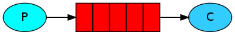
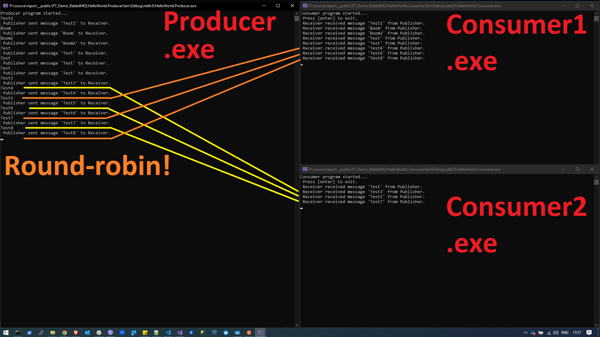
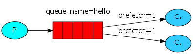
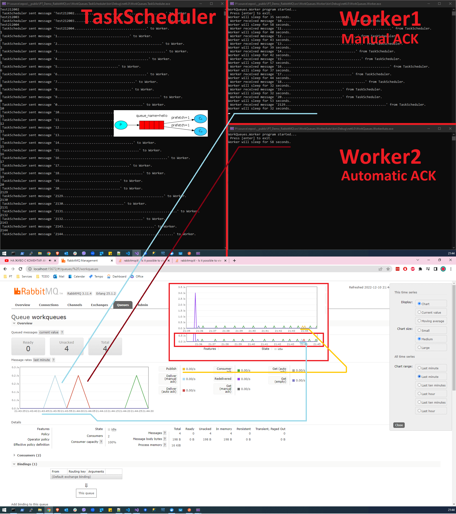
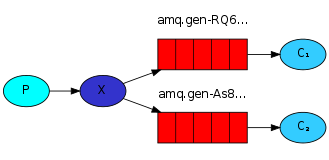
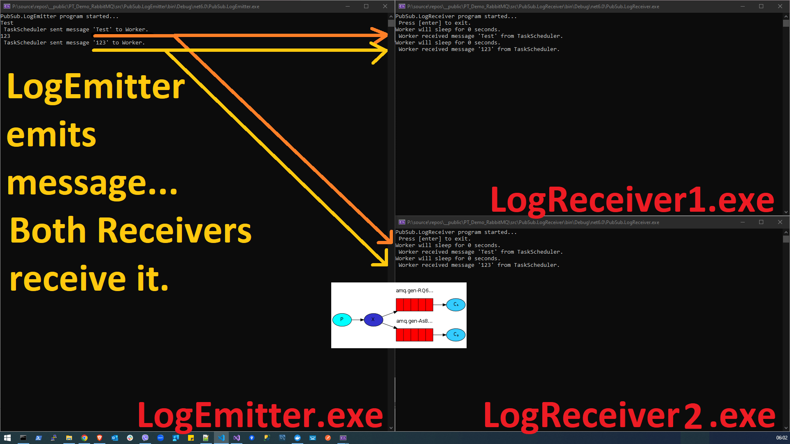
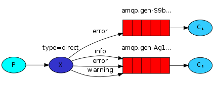
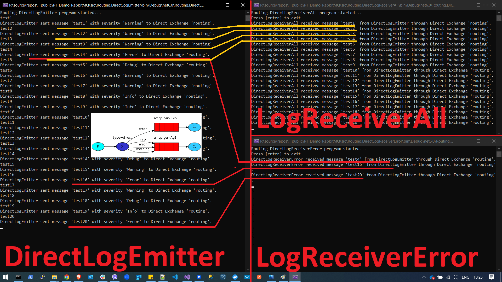
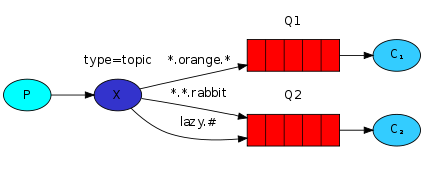
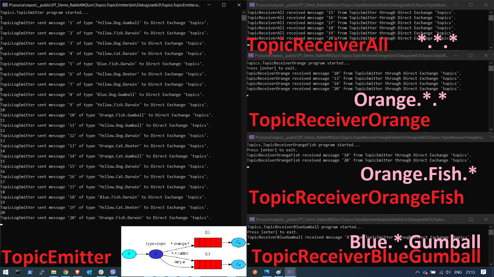

# PT_Demo_RabbitMQ

# Initial Setup

1. Run the Image in a Docker Container (on port 5672) locally:  
**docker run -d -it --rm --name rabbitmqcontainer -p 5672:5672 -p 15672:15672 rabbitmq:3.11-management**

2. Open the Terminal of the **rabbitmqcontainer** in Docker Desktop and enter the following commands **:  
**rabbitmq-plugins enable rabbitmq_management**

3. Open the RabbitMQ Management UI on http://localhost:15672/#/.  
In order to have admin rights, you need to login with the default admin username (guest) and password (guest).

** Once in the Terminal, you can also play with these commands:  
**rabbitmqctl status** // gets the status  
**rabbitmqctl list_queues name messages_ready messages_unacknowledged** // get a list of queues etc.  
**rabbitmqadmin get queue=workqueues**  // gets the last message in the queue

---

# Projects

## 1. HelloWorld

### Setup
3. Run an instance of **HelloWorld.Producer** in Console.
4. Run 1 or 2 instances of **HelloWorld.Consumer** in Console.

---

## 2. WorkQueues

### Setup
4. Run an instance of **WorkQueues.TaskScheduler** in Console.
5. Run 1 or 2 instances of **WorkQueues.Worker** in Console.

---

## 3. PubSub (*Publish/Subscribe*)

### Setup
4. Run an instance of **PubSub.LogEmitter** in Console.
5. Run 2 instances of **PubSub.LogReceiver** in Console.

---

## 4. Routing

### Setup
4. Run an instance of **Routing.DirectLogEmitter** in Console.
5. Run an instance of **Routing.DirectLogReceiverAll** in Console.
6. Run an instance of **Routing.DirectLogReceiverError** in Console.

---

## 5. Topics

### Setup
4. Run an instance of **Routing.TopicEmitter** in Console.
5. Run an instance of **Routing.TopicReceiverAll** in Console.
6. Run an instance of **Routing.TopicReceiverOrange** in Console.
7. Run an instance of **Routing.TopicReceiverOrangeFish** in Console.
8. Run an instance of **Routing.TopicReceiverBlueGumball** in Console.

---