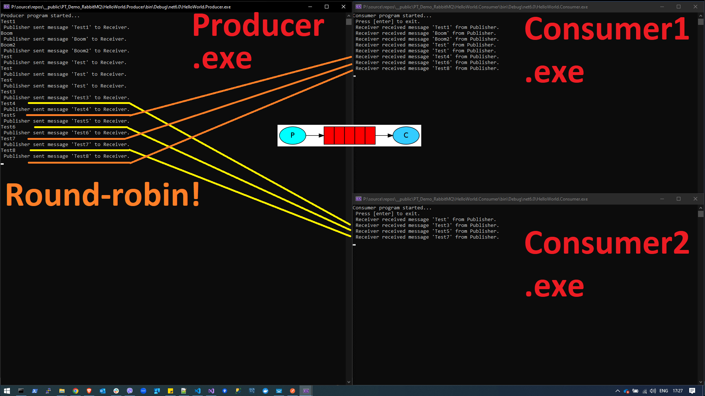

# PT_Demo_RabbitMQ

## HelloWorld

### Set up:

1. Pull the RabbitMQ Docker image:  
    **docker pull rabbitmq:latest**

2. Run the image in a Docker Container (on port 5672) locally:  
**docker run -p 5672:5672 -d --name rabbitmqcontainer rabbitmq:latest**

3. Run an instance of **HelloWorld.Producer** in Console.

4. Run 1 or 2 instances of **HelloWorld.Consumer** in Console.